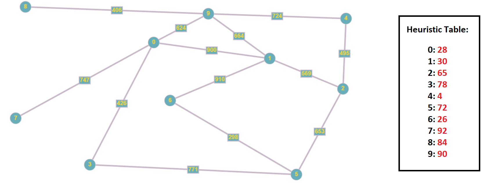

File main.py mình chạy thử với map có 10 điểm, và mỗi điểm nối tới ít nhất là 0 điểm, tối đa 5 điểm. 
Bắt đầu từ <b>6</b>, kết thúc là <b>2</b>.

## Giải thích:

* main.py - File chính của project, dùng để chạy thử

* mymap.py - Dùng để load bản đồ

* mymap.png - Hình ảnh minh họa bản đồ

* modules.py - Chứa các hàm hỗ trợ cho việc in các bước di chuyển và kết quả ra màn hình

* astar.py - Chứa thuật toán A*(GBFS + UCS)

## Bản đồ

## Kết quả:
Với map bên trên, start = 6, target = 2

Các bước (from, f(n), to):

1. (6, 0, 6)
2. (6, 370.0620740718282, 5), (6, 940.4641673344427, 1)
3. (6, 940.4641673344427, 1), (5, 1016.5029665785644, 2), (5, 1147.2637338210795, 3)
4. (5, 1016.5029665785644, 2), (5, 1147.2637338210795, 3), (1, 1664.4829923687935, 9), (1, 1839.3892474604208, 0)

Kết quả: 6 -> 5 -> 2
