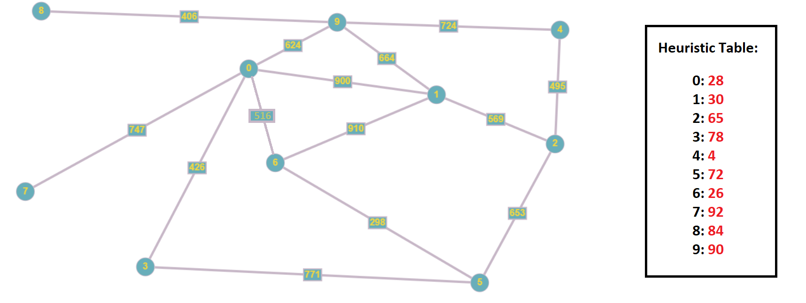

File main.py mình chạy thử với 10 điểm, và mỗi điểm nối tới ít nhất là 0 điểm, tối đa 3 điểm.

## Giải thích:

* main.py - File chính của project, dùng để chạy thử

* mymap.py - Dùng để load bản đồ

* mymap.png - Hình ảnh minh họa bản đồ

* modules.py - Chứa các hàm hỗ trợ cho việc in các bước di chuyển và kết quả ra màn hình

* astar.py - Chứa thuật toán A*(GBFS + UCS)

## Bản đồ

